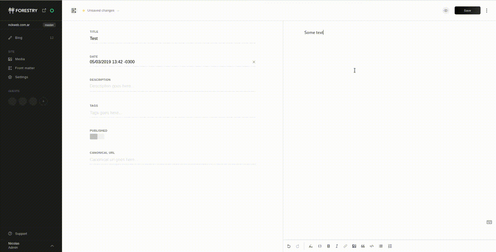

# Forestry Desktop Enhancer

**This extension is unofficial and comunnity developed**

This is a [Chrome extension](https://developer.chrome.com/extensions) that enhance desktop experience of [forestry](https://forestry.io)

Features:
1. [Collapsable front matter panel](https://portal.productboard.com/forestry/c/14-collapsable-front-matter-panel)
    
2. Remembers last sort option used in the _sections_ page.

## Development

1. `yarn install`
2. `yarn watch`
3. Run: (You can do it in any of the following ways)
  - `yarn launch`
  - Import extension: https://developer.chrome.com/extensions/getstarted#manifest

## Building

1. `yarn install`
2. `yarn build`
